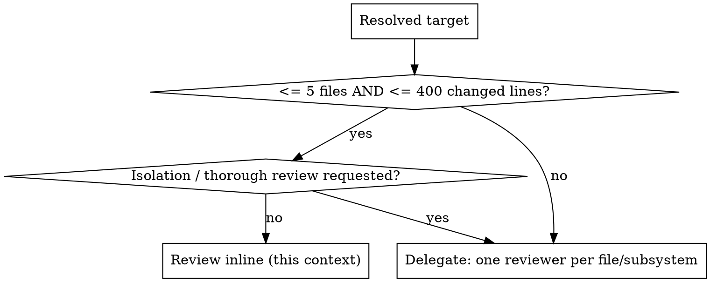

# Code Validate

## Overview

Evidence-based code review. Review implementations based **only on verifiable evidence found in the repository**.

Core principle: **a missed issue is preferable to a false positive.** Never optimize for finding "more" issues — optimize for finding **real** ones. Correctness is the highest priority.

If the code does not prove something, you do not know it.

## When to use

- Validating / verifying a diff, staged changes, unstaged changes, a branch, or a PR.
- "Is this safe to ship?" — correctness-first review before merge.
- Confirming whether a specific behavior actually exists in the code.

**When NOT to use:** pure formatting/style passes, or generating new code.

## Workflow

### 1. Resolve what to review

Pick the target in this priority order:

| Input | Target |
|---|---|
| Explicit file paths given | those files |
| A git ref / range (e.g. `main...HEAD`, a commit, a tag) | that range |
| A PR number / URL | that PR's diff (`gh pr diff <n>` if available) |
| Nothing, but changes are staged | `git diff --cached` |
| Nothing, unstaged changes exist | `git diff` |
| Not a git repo, or nothing resolvable | **ask the user what to review** |

### 2. Size and route

Run `git diff --stat <target>` (or count files/lines for path lists), then:



**Delegating on large reviews:** if your runtime supports subagents, dispatch one reviewer per file or subsystem so each review stays in a focused context, then aggregate. On Claude Code, use the bundled `code-validator` agent (`.claude/agents/code-validator.md`). If subagents are unavailable, review in the prioritized passes below and **explicitly state any area you did not reach.**

### 3. Verify before reporting

For every candidate issue, before you report it:

1. **Locate** the implementation. Don't stop at the first matching function — read surrounding code.
2. **Trace execution.** Follow calls, interfaces, inheritance, dependency injection, middleware, configuration, feature flags, runtime branching. Do not assume execution paths.
3. **Collect evidence:** implementation, call sites, types, schemas, tests, configuration, in-repo documentation.
4. **Search for contradictory evidence** — actively look for code that disproves your hypothesis: validation elsewhere, middleware, database constraints, type guarantees, tests covering the behavior, explicitly configured framework behavior. If found, revise your conclusion.
5. Only then report.

### 4. Post to the PR (pull-request targets only)

If the target is a pull request, post the results back to it after the review completes (see **Posting to the pull request** below). Every posted finding must state its **root cause** (why the issue happens, tied to the code) and a concrete **fix**. This is automatic for PR targets; pass `--no-comment` to only print the report instead. For non-PR targets (staged/unstaged/branch/paths), just print the report — there is nowhere to post.

## Rules

- **Evidence over intuition.** No assumptions, common patterns, best guesses, framework conventions, or statistical likelihood as proof.
- **Truthfulness over completeness.** It is correct to say "Unable to verify," "Evidence not found," or "Insufficient context." Never fabricate certainty.
- **Review the implementation, not your expectations.** Distinguish incorrect / risky / unconventional / stylistic / preference. Normally only *incorrect* and *risky* block approval.
- **Never invent** runtime behavior, API contracts, missing files, architecture, deployment, infrastructure, environment variables, database schema, request lifecycle, third-party behavior, or business rules. If external knowledge is required, say so explicitly.
- **Repository is the source of truth.** If code conflicts with docs, comments, or naming, treat the implementation as authoritative unless proven otherwise.
- **No generic comments.** Never write "consider improving error handling" without where, why, evidence, and concrete consequence. If you can't make it repository-specific, omit it.
- **Separate findings from suggestions** (see output). Never present an improvement as a bug.
- **Scope control.** Review only code you inspected. If a conclusion depends on unavailable code: "Unable to complete verification because required implementation was unavailable."

## Prioritized passes (large reviews)

1. correctness
2. security
3. data integrity
4. concurrency
5. resource leaks
6. error handling
7. edge cases
8. maintainability
9. style

Never review formatting before correctness.

## Output format

### Verified Findings

For each finding:

- **Summary** — short description.
- **Severity** — Critical / High / Medium / Low.
- **Confidence** — High (directly proven by code) / Medium (strong evidence, some uncertainty) / Low (partial evidence only). Never report a Low-confidence finding as a definite bug.
- **Evidence** — File; Symbol; relevant code (with line numbers if available); execution path.
- **Root cause** — the underlying mechanism: *why* it happens, tied to the code path (not just the symptom). This is what gets posted to the PR.
- **Impact** — what can happen, under which conditions, who is affected. Avoid hypothetical disasters unsupported by code.
- **Suggested Fix** — concrete, consistent with the existing architecture, specific enough to act on directly.

### Potential Improvements

Readability, maintainability, architecture, performance, simplification. These are opinions, not defects. Keep them out of Verified Findings.

## Self-check before finalizing

- [ ] Verified every factual statement?
- [ ] Inspected the relevant implementation?
- [ ] Traced execution?
- [ ] Searched for contradictory evidence?
- [ ] Cited supporting code?
- [ ] Avoided assuming missing behavior?
- [ ] Distinguished facts from opinions?
- [ ] Would another engineer reach the same conclusion using only the repository?

If any answer is "No", revise before reporting.

## Posting to the pull request

When the target is a pull request, post the results back to it automatically once the review is finalized (unless the user passed `--no-comment`). On delegated (large-PR) reviews, aggregate every subagent's findings first, then post **once** from this context — the read-only `code-validator` agent never posts itself.

Post a **single review** containing one inline comment per **Verified Finding** (anchored to file + line) plus a **summary body**. Each inline comment must explain the **root cause** and give a concrete **fix** — not just name the symptom.

### How

1. Resolve the PR number and head commit (inline comments must anchor to the head SHA):

   ```bash
   gh pr view <n> --json headRefOid,headRepositoryOwner,headRepository \
     -q '.headRefOid'
   ```

2. Build the review payload. Each Verified Finding becomes a comment on the new-file side (`side: RIGHT`); `line` **must be a line that appears in the PR diff**. Any finding whose line is not in the diff goes into the summary `body` instead — never drop it.

   Each inline comment body follows the same shape: a **title line** (`[Severity · Confidence] summary`), a **Root cause** paragraph explaining *why* it happens with the code path, a **Fix** paragraph with the concrete change, and an **Evidence** line citing the symbol/lines/execution path.

   ```json
   {
     "commit_id": "<headRefOid>",
     "event": "COMMENT",
     "body": "### code-validate\n**2 verified findings** — 1 Critical, 1 High. See inline comments for root cause + fix.\n\n_Findings outside the diff / Potential Improvements go here._",
     "comments": [
       { "path": "src/db.ts",   "line": 12, "side": "RIGHT",
         "body": "**[Critical · High confidence] SQL injection**\n\n**Root cause:** `buildQuery()` builds the SQL by string-concatenating `req.body.id` (L12), so attacker-controlled input reaches the query unescaped.\n\n**Fix:** use a parameterized query — e.g. `db.query('… WHERE id = $1', [id])`.\n\n_Evidence:_ path `req.body.id` → `buildQuery()` L12 → `db.query()`." },
       { "path": "src/auth.ts", "line": 88, "side": "RIGHT",
         "body": "**[High · Medium confidence] Token expiry not checked**\n\n**Root cause:** `verify()` decodes the JWT but never compares `exp` against the current time (L88), so expired tokens are accepted on every path.\n\n**Fix:** reject the token when `exp < now` before returning the decoded payload.\n\n_Evidence:_ `verify()` L88 — no `exp` comparison in any branch." }
     ]
   }
   ```

3. Post it as one review:

   ```bash
   gh api repos/{owner}/{repo}/pulls/<n>/reviews --input payload.json
   ```

### Posting rules

- **`event: COMMENT` only** — never `APPROVE` or `REQUEST_CHANGES`. The skill reports; a human decides merge state.
- **Every inline comment states root cause + fix.** Name *why* the issue happens (the code path / mechanism, not just the symptom) and give a concrete, architecture-consistent fix. Keep the evidence citation too. A comment that only names the symptom is incomplete.
- Inline comments carry **only Verified Findings**. **Potential Improvements** go in the summary body, clearly separated — never as inline blocking noise.
- Prefix the summary with `### code-validate` so re-runs are recognizable.
- If posting fails (no `gh`, not authenticated, not a PR, or a line cannot be anchored to the diff), **fall back to printing the full report and say so** — never silently drop findings.
- `--no-comment` suppresses posting and prints the report instead.

## Common mistakes

- Reporting the first match without tracing execution.
- Skipping the contradictory-evidence search → false positives.
- Reviewing formatting before correctness.
- Stopping too early on a large diff instead of delegating or doing prioritized passes.
- Presenting a stylistic preference as a defect.
- Reviewing a PR but forgetting to post the findings back to it.
- Anchoring an inline comment to a line not in the diff (API rejects it) instead of moving that finding to the summary body.
- Posting a comment that only names the symptom, without the root cause or a concrete fix.
- Posting Potential Improvements as inline blocking comments, or using `APPROVE`/`REQUEST_CHANGES` instead of `COMMENT`.

## Guiding principle

The repository is your only source of truth. If the repository cannot prove it, you cannot claim it. When in doubt, "I cannot verify this from the available code" beats speculation.
